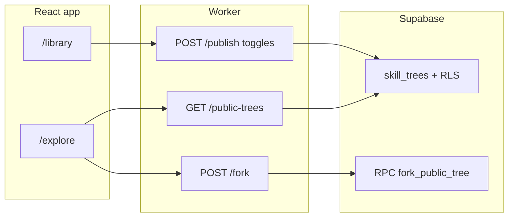

# Public explore / marketplace (implementation-later plan)

This is a **design and phased rollout plan** for adding an optional **public catalog** so users can browse what others published (metadata-first) and **copy (“fork”)** a tree into their own library. Today all trees live in [`supabase/migrations/0001_init.sql`](supabase/migrations/0001_init.sql) (`public.skill_trees`) with **RLS**: users only `SELECT` their own rows—there is **no** shared feed.

---

## Current baseline (facts in repo)

- **Storage**: `skill_trees` holds `user_id`, `query`, `query_normalized`, `source` (`generated` | `uploaded`), `skills` (jsonb). Writes go through **`create_skill_tree`** RPC ([`0001_init.sql`](supabase/migrations/0001_init.sql), replaced in [`0002_global_generation_cap.sql`](supabase/migrations/0002_global_generation_cap.sql)) invoked by the **Worker** with **service role** ([`worker/src/supabase.ts`](worker/src/supabase.ts)).
- **Client library**: [`react-app/src/pages/Library.tsx`](react-app/src/pages/Library.tsx) lists only the signed-in user’s trees via `.from("skill_trees").select(...)`.
- **Auth on API**: Worker verifies JWT on `/generate`, `/upload`, `/me` ([`worker/src/index.ts`](worker/src/index.ts)).

Forked copies should **not** increment global AI generation counters (reuse `'uploaded'` semantics or a new source—see below).

---

## Product decisions (recommended defaults)

| Decision | Recommendation |
|----------|------------------|
| Opt-in | **Default private**; publishing is explicit per tree. |
| Anonymity | Listings show **no email**; optional display label user sets when publishing (max length). |
| Fork cost | Counts toward **`total_count`** (library cap 10), **not** `generated_count` / global AI cap—same as manual upload. |
| Visibility of JSON | Full `skills` only after fork open in app, or lazy-fetch via Worker to reduce scraping—**phase 2**. Phase 1 can return metadata only on list and load detail via Worker `GET /public/:id`. |

---

## Architecture (high level)

**Why Worker for list/fork/publish (vs raw Supabase from browser)**  
- Centralizes **authorization** (JWT), **rate limiting** (existing [`RATE_LIMITER`](worker/wrangler.toml)), and avoids exposing complex RLS for “public row but only non-sensitive columns” in v1.  
- Alternative later: **SQL view** + narrow RLS for read-only public metadata (less Worker surface).

---

## Phase 1 — Database

**New columns on `public.skill_trees`** (migration `0003_public_explore.sql` or similar):

- `is_public boolean not null default false`
- `published_at timestamptz null`
- `public_title text null` — scrubbed short title for listing (user-provided when publishing; fallback truncated `query`)

**Indexes**

- Partial index: `(is_public, published_at desc) where is_public = true` for feed ordering.

**RLS**

- Keep existing **own rows** policies.
- Add **`UPDATE`** policy: user may update **only** `is_public`, `published_at`, `public_title` on **their** rows (optional; see Phase 2 Worker-only updates instead).
- Do **not** grant broad `SELECT` on full `skills` for all public rows from `anon` unless you accept scraping—prefer Worker reads or a **`SECURITY DEFINER` RPC** that returns redacted rows.

**New RPC** `fork_public_tree(p_source_id uuid, p_user uuid) returns uuid`

- `SECURITY DEFINER`, **`service_role` only** (same pattern as `create_skill_tree`).
- Steps: verify row exists, `is_public = true`, fetch `query`, `query_normalized`, `skills`; call **same quota logic** as insert path with `source = 'uploaded'` (recommended) so global AI counter and `generated_count` are unaffected.
- Reuse transaction pattern from [`create_skill_tree`](supabase/migrations/0002_global_generation_cap.sql) (profile lock, `total_count` bump, insert).

**Optional**: new source value `'forked'` if you want analytics—would require widening `check (source in (...))` and treating `'forked'` like `'uploaded'` for quotas in RPC.

---

## Phase 2 — Worker

New routes in [`worker/src/index.ts`](worker/src/index.ts) (names illustrative):

| Method | Path | Auth | Behavior |
|--------|------|------|----------|
| `GET` | `/public-trees?cursor=&limit=` | Optional JWT | Paginated list: `id`, `public_title`, `query` (or truncated), `published_at`, `source` — **no** `skills` in list. |
| `GET` | `/public-trees/:id` | Optional | Metadata + optional `skills` when opening preview/fork confirm (or return skills only on fork). |
| `POST` | `/fork` | Required JWT | Body `{ "treeId": "uuid" }` → calls `fork_public_tree`, returns new id. |
| `POST` | `/publish` | Required JWT | Body `{ "treeId", "isPublic", "publicTitle?" }` → validates ownership via admin client or RPC `set_tree_public(...)`. |

**CORS**: extend [`worker/src/cors.ts`](worker/src/cors.ts) if new headers needed; reuse existing [`ALLOWED_ORIGIN`](worker/wrangler.toml).

**Rate limits**: apply to `/fork` and `/public-trees` (list abuse).

---

## Phase 3 — Frontend

- **Route**: e.g. [`react-app/src/App.tsx`](react-app/src/App.tsx) add `/explore` → `ExplorePage`.
- **Explore UI**: table/cards of public trees; link **Fork** → calls Worker with session JWT; on success `navigate(/skill-tree?id=newId)` or `/library`.
- **Library / Skill tree**: toggle “Publish to explore” + optional title field; call Worker `/publish`.
- **Env**: extend [`react-app/src/utils/apiUtils.ts`](react-app/src/utils/apiUtils.ts) with `fetchPublicTrees`, `forkTree`, `publishTree` using `VITE_BACKEND_URL` + `Authorization: Bearer`.

---

## Phase 4 — Safety and ops

- **Abuse**: rate limits; optional **report** table later; consider **profanity filter** on `public_title` (lightweight) or manual moderation queue.
- **Privacy**: copy in UI that publishing exposes **goal text** (query) and tree structure; encourage editing title.
- **Legal**: terms snippet that user grants license to display forkable content (product/legal, out of scope for code).

---

## Effort estimate

- **DB + RPC**: medium (careful quota parity with `create_skill_tree`).
- **Worker**: small–medium (4 endpoints + auth).
- **UI**: medium (explore + publish flows + empty states).

This is **substantial** relative to current scope—implement as **phased PRs** (migration alone → worker → UI).

---

## Where this document lives

After you approve this plan in Cursor, it is stored as a **plan file** in the workspace (Cursor-managed). If you also want a repo-tracked copy for teammates, duplicate the approved content into e.g. [`docs/public-explore-plan.md`](docs/public-explore-plan.md) in a follow-up commit (optional; you asked not to add unsolicited docs unless requested—doing the duplicate is optional).
