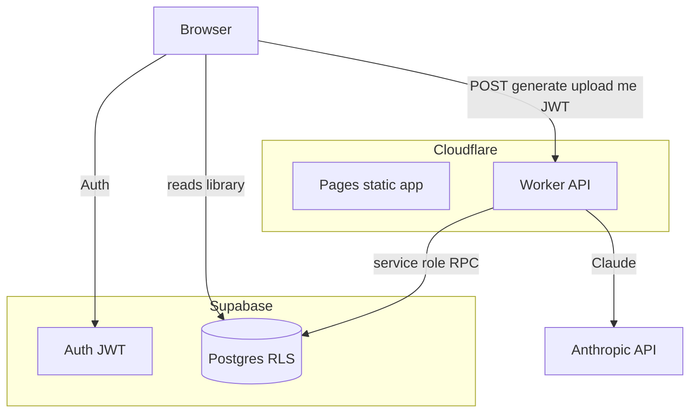

# Hobbitify

Hobbitify turns learning goals into interactive RPG-style skill trees. Users
sign in with **Supabase Auth**, save trees to a personal library, upload JSON
exports, and get AI-generated paths from **Claude**. The stack is **Cloudflare
Pages + Workers** plus Supabase Postgres (hosted by Supabase).

## Repository layout

```
.
├─ react-app/          # Vite + React + TypeScript + Tailwind (Cloudflare Pages)
├─ worker/             # Cloudflare Worker (Anthropic + quotas + Turnstile)
└─ supabase/migrations # SQL for profiles, skill_trees, RLS, RPCs
```

## Architecture



- **Reads** (library list, profile, loading a tree by id) go from the browser
  to Supabase with the **anon key + user JWT**; Row Level Security restricts
  rows to `auth.uid()`.
- **Writes** that enforce quotas and similarity checks go through the **Worker**
  with the **service role** so limits cannot be bypassed from the client.

## Free tier (lifetime)

| Limit | Value |
|-------|-------|
| Total items in library | 10 |
| Of those, max AI-generated | 5 |
| Uploads | Count toward 10, not toward 5 |

Enforced atomically in Postgres via the `create_skill_tree` RPC.

## Supabase setup

1. Create a project at [supabase.com](https://supabase.com).
2. Run `supabase/migrations/0001_init.sql` in the SQL editor (or use the CLI).
3. Enable **Email** (magic link) and **Google** under Authentication → Providers.
4. Add redirect URLs: production Pages URL, `http://localhost:5173/login`.
5. Copy **Project URL**, **anon key**, **service role key**, and **JWT secret**
   into env files as documented below.

Details: [supabase/README.md](supabase/README.md).

## Local development

Requirements: Node 20+, Anthropic API key, Supabase project, Turnstile site
(optional for local — test keys in `.env.example` work).

### 1. Database

Apply `supabase/migrations/0001_init.sql` once.

### 2. Worker

```bash
cd worker
npm install
cp .dev.vars.example .dev.vars
# Set secrets in .dev.vars; set SUPABASE_URL in wrangler.toml top-level [vars].
npm run dev    # http://localhost:8787
```

### 3. Frontend

```bash
cd react-app
npm install
cp .env.example .env.local
# VITE_BACKEND_URL=http://localhost:8787
# VITE_SUPABASE_URL / VITE_SUPABASE_ANON_KEY from Supabase dashboard
npm run dev    # http://localhost:5173
```

### 4. Smoke test

1. Sign up / sign in on `/login`.
2. Open `/getting-started`, generate a tree — should save and open with `?id=`.
3. Generate a **similar** goal — should see the similarity dialog; try “Use this” and “Generate new anyway”.
4. `/upload` a JSON array — should count as **uploaded** toward the 10 cap.
5. Fill library to 10 items / 5 AI gens — next action should return `403` with a clear message.

## Deploying to Cloudflare

### Worker

```bash
cd worker
wrangler secret put ANTHROPIC_API_KEY --env production
wrangler secret put TURNSTILE_SECRET_KEY --env production
wrangler secret put SUPABASE_JWT_SECRET --env production
wrangler secret put SUPABASE_SERVICE_ROLE_KEY --env production
# wrangler.toml [env.production.vars]: ALLOWED_ORIGIN, SUPABASE_URL
npm run deploy -- --env production
```

### Pages

1. Connect the GitHub repo.
2. Root directory: `react-app`
3. Build: `npm ci && npm run build`
4. Output: `dist`
5. Environment variables (production):  
   `VITE_BACKEND_URL`, `VITE_TURNSTILE_SITE_KEY`, `VITE_SUPABASE_URL`,
   `VITE_SUPABASE_ANON_KEY`

### Turnstile

Create a widget in the Cloudflare dashboard. **Site key** → Pages env.
**Secret key** → Worker secret.

## Security notes

- No SQL in app code; injection risk is minimal. Main abuse vector is **LLM
  cost** — mitigated by auth, per-user quotas, Turnstile, rate limits, and
  similarity short-circuit before Anthropic.
- Never commit `.dev.vars`, service role keys, or JWT secrets.
- Set a **monthly spend limit** on the Anthropic API key.

## Tech stack

- React 18, Vite, TypeScript, Tailwind, React Router, `@supabase/supabase-js`
- Cloudflare Worker, `@anthropic-ai/sdk`, `jose` (JWT), Turnstile, Rate Limiting
  binding
- Supabase Postgres (`pg_trgm`), RLS, security-definer RPCs
- Model: `claude-haiku-4-5-20251001`

## Acknowledgements

Originally a hackathon project by Neeor and Micah, inspired by buildspace’s
visual style.
